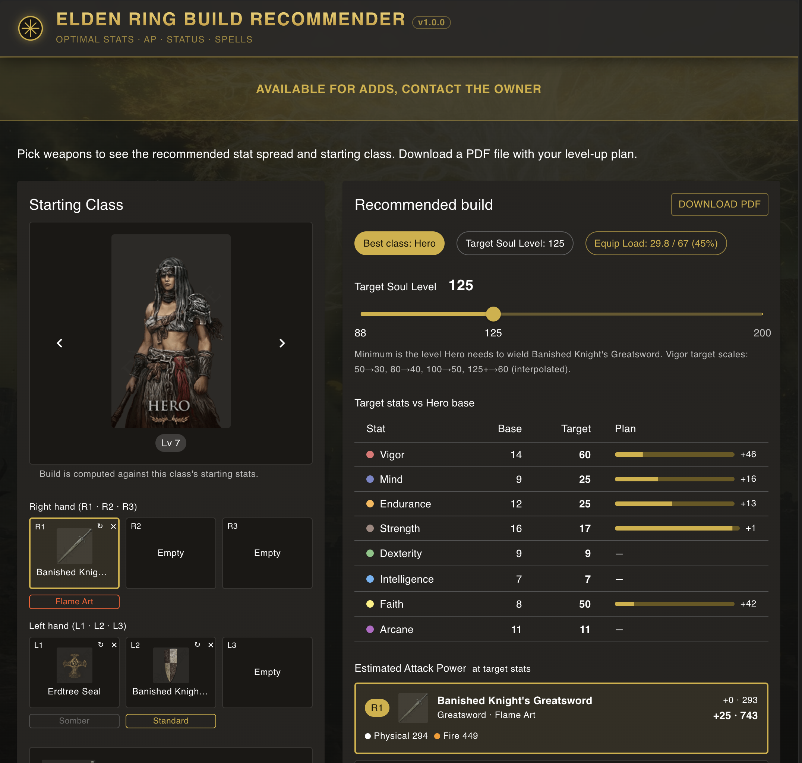

# Tarnished Builds

A single-page web app that turns a weapon loadout + a starting class + a target Soul Level into an optimal stat spread, an attack-power breakdown per weapon, suggested spells, and a downloadable PDF level-up plan.

Live site: **[tarnishedbuilds.com](https://tarnishedbuilds.com/)**



## Features

- **Loadout-driven recommendations.** Pick up to 6 weapons (3 per hand), an infusion / affinity per slot, armor, talismans, and the recommender computes hard requirements, scaling soft caps, vigor / mind / endurance floors, equip-load fit, and budget-fits everything to the slider's target Soul Level.
- **Two-hand aware.** Toggling two-hand applies the in-game ×1.5 Strength multiplier so the Strength target drops to the breakpoint that actually matters (e.g. 54 for soft cap, 60 for second-tier, never past 66 since 66 × 1.5 = the 99 hard cap).
- **Per-damage-type AP.** Estimated attack power split into Physical / Magic / Fire / Lightning / Holy plus status build-up (Bleed, Poison, Frost, Scarlet Rot, Sleep, Madness). Sources the actual regulation curves from the game data, not letter-grade approximations.
- **Catalyst-aware.** Drop in a staff or seal and the recommender lifts Mind to a caster floor, suggests sorceries / incantations under the 10-memory-slot cap, prefers spells boosted by the catalysts in your loadout, and shows Sorcery / Incant Scaling values.
- **PDF export.** One click produces a printable build plan including target stats, level-up steps, AP per weapon, and spell suggestions.
- **Class ranking.** Sorts all 10 starting classes by waste + final Soul Level to show which class fits the target stats best.

## Tech stack

- React 18 + TypeScript + Vite 5
- MUI v9 (dark theme, gold-on-near-black)
- React Router 6 (single route)
- `jspdf` + `jspdf-autotable` for the PDF report
- Google Analytics 4 (optional, gated on env var)

## Running locally

```bash
npm install
npm run dev      # http://localhost:5179
npm run build    # tsc -b + vite build
npm run preview  # serve the production build
```

`npm run build` is the only quality gate — `tsc -b` runs in `strict`, `noUnusedLocals`, and `noUnusedParameters` mode.

## Environment variables

| Variable | Required? | Purpose |
|---|---|---|
| `VITE_GA_MEASUREMENT_ID` | optional | GA4 measurement id (format `G-XXXXXXXXXX`). When unset, the analytics module no-ops and gtag.js is never loaded. |

Copy `.env.example` to `.env` and fill in if you want analytics.

## Project structure

```
src/
├── App.tsx                          masthead, dark theme, Erdtree background
├── main.tsx                         entry, theme, initAnalytics()
├── pages/
│   ├── BuildPicker.tsx              the single page; orchestrates the picker UI
│   └── components/                  ClassCarousel, WeaponSlotsGrid, ArmorSlots,
│                                    TalismanSlots, LoadoutDamagePanel,
│                                    SpellRecommendations, RecommendationHeader,
│                                    TargetStatsTable, Rationale, ClassRanking
├── common/components/               shared GearTile + GearPicker
├── data/
│   ├── classes.ts                   10 starting classes
│   ├── weapons.ts                   ~250 weapons, hand-curated
│   ├── weapons-extras.ts            scaling tables + images, scraped (do not hand-edit)
│   ├── damage-types.ts              regulation data (Attack Element Correct, reinforce)
│   ├── talismans.ts                 155 talismans
│   ├── armor.ts                     723 armor pieces, machine-generated
│   └── spells.ts                    ~213 sorceries + incantations
└── lib/
    ├── recommender.ts               pure functions, the heart of the app
    ├── pdf-report.ts                jspdf level-up plan
    ├── analytics.ts                 GA4 loader + event helpers
    └── types.ts                     shared types and tuning constants
```

For a deep dive into how the recommender's stat targets, soft caps, two-hand multiplier, leftover-distribution priority, shield-inclusion rules, and budget-fit step work, see [CLAUDE.md](./CLAUDE.md).

## Data sources

- Starting classes, weapon and armor lists, talismans, and spell metadata are scraped from the [Elden Ring fextralife wiki](https://eldenring.wiki.fextralife.com).
- Per-damage-type AP, Attack Element Correct tables, and reinforce curves are sourced from the game's regulation data (`regulation-vanilla-v1.14.js` via tclark.io).

The big data files (`armor.ts`, `weapons-extras.ts`, `damage-types.ts`) are machine-generated — if a value looks wrong, fix the parser and regenerate, do not patch one entry.

## Security

The app has no backend, no auth, no cookies / local storage, and ships a defensive Content-Security-Policy meta tag in `index.html`. `npm audit` is clean. See the audit notes in commit history for the details.

## Contributing

This is a personal project and not currently accepting PRs, but feel free to fork — the recommender is pure functions, well-typed, and easy to extend with new affinities, starting classes, or events.

## License

[MIT](./LICENSE) — applies to the source code only. Weapon / armor / spell data and images are sourced from the Elden Ring fextralife wiki and the game's regulation file under their own terms; "Elden Ring" is a trademark of FromSoftware / Bandai Namco. See the LICENSE file for the full attribution note.
